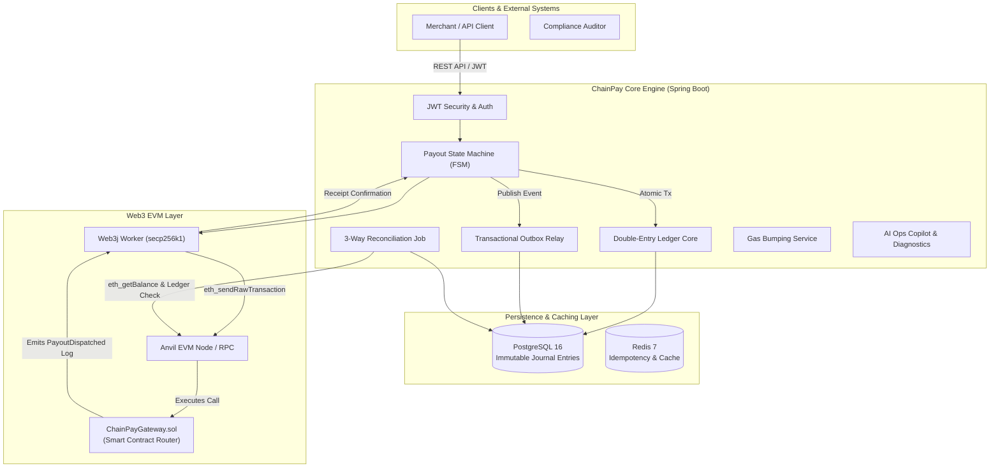

<div align="center">

# ⚡ ChainPay

### Blockchain Payout, Double-Entry Settlement & Web3 Ledger Engine

[](https://www.oracle.com/java/)
[](https://spring.io/projects/spring-boot)
[](file:///Users/shikharsingh/Downloads/code/java/bootpay/build.gradle)
[](file:///Users/shikharsingh/Downloads/code/java/bootpay/src/test/java)
[](https://www.postgresql.org/)
[](https://www.web3j.io/)
[](https://github.com/foundry-rs/foundry)
[](LICENSE)

*An immutable, high-throughput financial payout gateway and double-entry accounting engine designed for mission-critical Web3, stablecoin settlement (USDC/USDT), and multi-chain enterprise payments.*

[Architecture Playbook](docs/architecture-and-testing-guide.md) • [Local Anvil Guide](docs/local-anvil-testing-guide.md) • [Senior Interview Guide](docs/interview-deep-dive.md) • [Roadmap & Resume Strategy](docs/status.md)

</div>

---

## 📌 System Overview

**ChainPay** bridges the gap between traditional double-entry financial accounting and decentralized Ethereum Virtual Machine (EVM) blockchains. 

In enterprise fintech environments, generic single-column balance models fail due to race conditions, unaccounted fee drift, and mempool transaction stuck states. **ChainPay Core** solves this by strictly pairing an **immutable double-entry ledger** with an **idempotent Payout Finite State Machine (FSM)**, real **Web3j RPC event listeners**, **automatic gas price bumping**, **transactional outbox webhooks**, and **autonomous 3-way reconciliation**.

> [!IMPORTANT]
> **Zero-Sum Accounting Invariant**: Every transaction in ChainPay MUST satisfy `sum(DEBITS) == sum(CREDITS)` per asset in base units (`NUMERIC(38,0)`). Internal ledger balances and live EVM on-chain funds are continuously audited to guarantee zero silent balance drift.

---

## 🏗 System Architecture



---

## 🚀 Key Technical Pillars & Features

| Subsystem | Technical Implementation | Enterprise Guarantee |
| :--- | :--- | :--- |
| **Immutable Double-Entry Ledger** | Multi-asset `JournalEntry` pairs enforcing `sum(DEBITS) == sum(CREDITS)` at write time in base units (`NUMERIC(38,0)`). | Solvency guaranteed; zero balance drift; audit trail preserved forever. |
| **Payout Finite State Machine (FSM)** | Strict transition states: `PENDING → PROCESSING → SUBMITTED → CONFIRMING → COMPLETED` with terminal `FAILED_PERMANENTLY`. | Idempotent execution; no double-payouts under high concurrency. |
| **Monotonic Nonce Management** | 3-way monotonic nonce calculation: $\max(\text{RPC Pending Count}, \text{DB Max Nonce} + 1, \text{Memory Tracker} + 1)$. | Bulletproof transaction ordering across multi-threaded workers. |
| **Dynamic Gas Price Bumping** | Automated monitoring of stuck mempool transactions with EIP-1559 gas price scaling ($1.15 \times \text{gasPrice}$) and same-nonce re-broadcasting. | Zero transactions stuck indefinitely in network mempool. |
| **3-Way Reconciliation Engine** | Hourly automated job auditing Database Payouts, Local Ledger Journal Entries, and Live EVM Node (`ethGetBalance` & transaction receipts). | Automatic detection of chain re-orgs, missing transactions, or wallet balance drift. |
| **Transactional Outbox Pattern** | Atomic outbox event persistence in PostgreSQL with resilient background webhook delivery worker. | At-least-once event delivery for downstream webhooks without two-phase commit overhead. |
| **Multi-Chain EVM Registry** | `ChainAdapterRegistry` supporting Ethereum (`1`), Polygon (`137`), Arbitrum (`42161`), Base (`8453`), and Anvil (`31337`) with primary/backup RPC failover. | Resilient connection with multi-node RPC failover protection. |
| **AI Ops Copilot & Telemetry** | Autonomous anomaly detection scanning system drift, auto-creating `OperationalIncident` records, and exposing read-only tool APIs (`CopilotToolService`). | Proactive ops monitoring with LLM-ready diagnostic endpoints. |

---

## ⚡ Quick Start Guide

### Option A: Local Devnet & Gradle Setup (Recommended for Active Development)

1. **Start Local Anvil EVM Node**:
   ```bash
   anvil
   ```

2. **Deploy `ChainPayGateway.sol` Router Contract**:
   ```bash
   forge create contracts/ChainPayGateway.sol:ChainPayGateway \
     --rpc-url http://localhost:8545 \
     --private-key 0xac0974bec39a17e36ba4a6b4d238ff944bacb478cbed5efcae784d7bf4f2ff80 \
     --broadcast
   ```

3. **Start ChainPay Core Backend Engine**:
   ```bash
   ./gradlew bootRun --args='--spring.profiles.active=test'
   ```

4. **Run End-to-End Verification Harness**:
   ```bash
   python3 scripts/run-demo.py
   ```

---

### Option B: Turnkey Container Stack (1-Command Docker Deployment)

To launch PostgreSQL 16, Redis 7, Anvil EVM, Contract Auto-Deployer, and ChainPay Core seamlessly:

```bash
docker compose up --build
```

Then run the interactive demonstration script in a separate terminal:

```bash
python3 scripts/run-demo.py
```

> [!TIP]
> Interactive OpenAPI / Swagger UI documentation is live at: `http://localhost:8080/swagger-ui.html`

---

## 🧪 Benchmark & Concurrency Verification Suite

ChainPay Core includes a multi-threaded load benchmark suite verifying ledger integrity under heavy concurrent write loads.

To run the complete automated test suite (including 20-thread concurrency benchmarks and architecture governance rules):

```bash
./gradlew test --rerun-tasks
```

### Test Suite Coverage Highlights:
* **`ChainPayLoadBenchmarkTest`**: Executes 20 parallel threads posting simultaneous debit/credit entries, confirming zero-sum invariant holds 100% under high concurrency.
* **`ArchitectureGovernanceTest`**: Enforces strict package-by-feature boundary isolation and domain encapsulation via ArchUnit.
* **`LedgerServiceTest`**: Validates balanced multi-asset journal entries pass while unbalanced transactions are rejected.
* **`PayoutStateMachineTest`**: Tests legal and illegal state machine transitions across all 7 statuses.
* **`ReconciliationJobTest`**: Verifies 3-way balance mismatch detection between double-entry ledger and live Web3 node balances.

---

## 🔐 API Reference Overview

| Category | Method | Endpoint | Description | Idempotent |
| :--- | :--- | :--- | :--- | :---: |
| **Auth** | `POST` | `/api/v1/auth/login` | Authenticate and obtain JWT Access Token | No |
| **Auth** | `POST` | `/api/v1/auth/register` | Register new user account | No |
| **Ledger** | `POST` | `/api/v1/accounts` | Create system or customer double-entry account | Yes |
| **Ledger** | `GET` | `/api/v1/accounts/{id}/balance` | Query derived account balance in base units | Yes |
| **Ledger** | `POST` | `/api/v1/accounts/transactions` | Post balanced multi-line journal transaction | Yes |
| **Payouts** | `POST` | `/api/v1/payouts` | Submit single payout (Requires `Idempotency-Key`) | Yes |
| **Payouts** | `POST` | `/api/v1/payouts/batch` | Submit bulk payout request to Gateway contract | Yes |
| **Payouts** | `GET` | `/api/v1/payouts/{id}` | Query payout details, state, & confirmation height | Yes |
| **Payouts** | `POST` | `/api/v1/payouts/{id}/retry` | Manually retry failed payout | No |
| **Reconcile**| `POST` | `/api/v1/reconciliation/trigger` | Trigger immediate 3-way financial & Web3 audit | No |
| **Audit** | `GET` | `/api/v1/audit/export?format=CSV` | Export immutable compliance audit logs (CSV/JSON) | Yes |
| **Ops** | `GET` | `/api/v1/copilot/summary` | Read-only AI Ops Copilot telemetry summary | Yes |
| **Health** | `GET` | `/api/v1/health` | System diagnostics (Ledger integrity & Web3 node status) | Yes |

---

## 📄 License

This project is licensed under the MIT License — see the [LICENSE](LICENSE) file for details.
