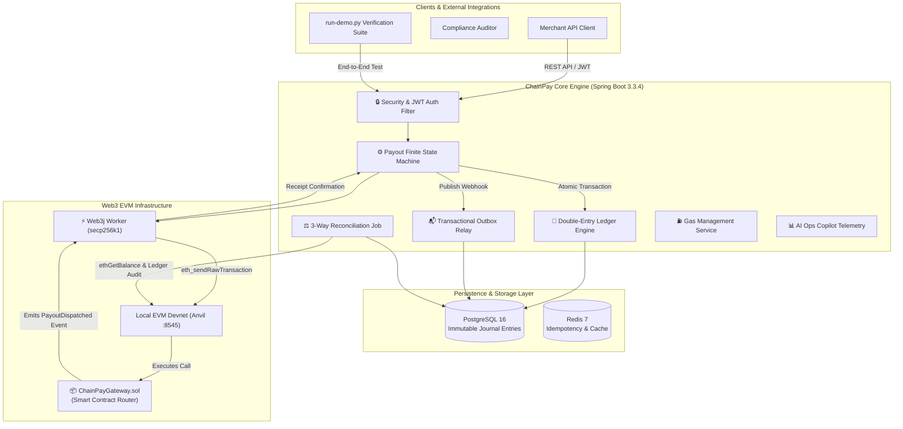

<div align="center">

# ⚡ ChainPay

### Enterprise Blockchain Payout, Double-Entry Settlement & Web3 Ledger Engine

[](https://www.oracle.com/java/)
[](https://spring.io/projects/spring-boot)
[](build.gradle)
[](src/test/java)
[](https://www.postgresql.org/)
[](https://www.web3j.io/)
[](https://github.com/foundry-rs/foundry)
[](LICENSE)

*An immutable, high-throughput financial payout gateway and double-entry accounting engine designed for mission-critical Web3, stablecoin settlement (USDC/USDT), and multi-chain enterprise payments.*

[Architecture Playbook](docs/architecture-and-testing-guide.md) • [Local Anvil Guide](docs/local-anvil-testing-guide.md) • [Technical Roadmap](docs/chainpay-core-technical-roadmap.md)

</div>

---

## 📌 Executive System Summary

**ChainPay Core** bridges the critical gap between traditional double-entry financial accounting and decentralized Ethereum Virtual Machine (EVM) blockchains. 

In enterprise fintech environments, generic single-column balance models (`UPDATE account SET balance = balance - amount`) fail under high-concurrency workloads due to race conditions, unaccounted gas fee drift, and mempool transaction stuck states. **ChainPay Core** eliminates these failure modes by strictly pairing an **immutable double-entry ledger** with an **idempotent Payout Finite State Machine (FSM)**, **Web3j RPC event listeners**, **dynamic EIP-1559 gas price scaling**, **transactional outbox webhooks**, and **automated 3-way reconciliation**.

> [!IMPORTANT]
> **Zero-Sum Accounting Invariant**: Every transaction in ChainPay MUST satisfy `sum(DEBITS) == sum(CREDITS)` per asset in base units (`NUMERIC(38,0)`). Internal ledger balances and live EVM on-chain funds are continuously audited to guarantee zero silent balance drift.

---

## 🏗 System Architecture



---

## 🚀 Key Technical Pillars & Core Engineering

| Subsystem | Technical Implementation | Enterprise Guarantee |
| :--- | :--- | :--- |
| **Immutable Double-Entry Ledger** | Multi-asset `JournalEntry` pairs enforcing `sum(DEBITS) == sum(CREDITS)` at write time in base units (`NUMERIC(38,0)`). | Solvency guaranteed; zero balance drift; audit trail preserved forever. |
| **Payout Finite State Machine (FSM)** | Strict state transitions: `PENDING → PROCESSING → SUBMITTED → CONFIRMING → COMPLETED` with terminal `FAILED_PERMANENTLY`. | Idempotent execution; zero double-payouts under high concurrency. |
| **Monotonic Nonce Management** | 3-way monotonic nonce calculation: $\max(\text{RPC Pending Count}, \text{DB Max Nonce} + 1, \text{Memory Tracker} + 1)$. | Bulletproof transaction ordering across multi-threaded workers without nonce gaps. |
| **Dynamic Gas Price Bumping** | Automated monitoring of stuck mempool transactions with EIP-1559 gas price scaling ($1.15 \times \text{gasPrice}$) and same-nonce re-broadcasting. | Zero transactions stuck indefinitely in network mempool. |
| **3-Way Reconciliation Engine** | Automated job auditing Database Payouts, Local Ledger Journal Entries, and Live EVM Node (`ethGetBalance` & transaction receipts). | Automatic detection of chain re-orgs, missing transactions, or wallet balance drift. |
| **Smart Contract Batch Router** | `ChainPayGateway.sol` executing multi-recipient payouts in a single atomic EVM transaction emitting indexed `PayoutDispatched` events. | Significant gas savings and atomic execution for bulk enterprise distributions. |
| **Transactional Outbox Pattern** | Atomic outbox event persistence in PostgreSQL with resilient background webhook delivery worker. | At-least-once event delivery for downstream webhooks without two-phase commit overhead. |
| **AI Ops Copilot & Telemetry** | Autonomous anomaly detection scanning system drift, auto-creating `OperationalIncident` records, and exposing read-only tool APIs. | Proactive ops monitoring with LLM-ready diagnostic endpoints. |

---

## 🖥 Behind-The-Scenes Verification Harness (`run-demo.py`)

ChainPay Core includes an interactive, highly detailed end-to-end verification harness ([scripts/run-demo.py](scripts/run-demo.py)) that executes all 7 core payment subsystems while printing step-by-step behind-the-scenes engineering explanations.

### Sample Verification Terminal Output:

```text
============================================================================
      ⚡ CHAINPAY CORE — WEB3 PAYMENT & SETTLEMENT ENGINE SHOWCASE ⚡     
============================================================================
  • Core Engine Architecture : Java 21/25 · Spring Boot 3.3.4 · PostgreSQL 16 · Redis 7
  • EVM RPC Node Integration : Web3j Client -> Anvil Local Devnet (http://127.0.0.1:8545)
  • Hot Wallet Address (KMS) : 0xf39Fd6e51aad88F6F4ce6aB8827279cffFb92266 (Account #0)
  • Financial Solvency Model : Immutable Double-Entry Ledger [NUMERIC(38,0) wei]
============================================================================

============================================================================
  🔒 1. SECURITY & JWT TOKEN AUTHENTICATION
============================================================================
  ✅  [VERIFIED]  JWT Authentication credential verified successfully
  ℹ️   Authenticated Username          : admin
  ℹ️   Granted Security Role           : ADMIN
  ℹ️   Token Cryptographic Scheme      : HMAC-SHA256 (JJWT)
  ℹ️   JWT Access Token Snippet        : eyJhbGciOiJIUzI1NiJ9.eyJzdWIiOiJhZG1...
  ℹ️   Token Expiration Window         : 24 Hours (86,400,000 ms)

  🔍  [BEHIND THE SCENES ENGINE ARCHITECTURE]
      │ Spring Security intercepts incoming HTTP request via JwtAuthenticationFilter.
      │ Validates HMAC-SHA256 signature against JWT secret key.
      │ Extracts UserPrincipal & Role.ADMIN, populating SecurityContextHolder for @PreAuthorize method checks.
      └────────────────────────────────────────────────────────────────────

============================================================================
  🏦 2. DOUBLE-ENTRY LEDGER & EVM NODE DISCOVERY
============================================================================
  ℹ️   Double-Entry Invariant Status   : ZERO_SUM_INVARIANT_VALIDATED
  ℹ️   EVM RPC Node Connection         : CONNECTED
  ℹ️   Anvil RPC URL Endpoint          : http://localhost:8545 (Chain ID: 31337)
  ℹ️   Current Anvil Block Height      : Block #12
  ✅  [VERIFIED]  Discovered Customer Account: ACC-CUSTOMER-ETH-001
  ℹ️   Account UUID                    : d29df35f-3913-4cb7-86c0-0b58f2ac8b53
  ℹ️   Account Type                    : CUSTOMER_AVAILABLE
  ℹ️   Asset Symbol & UUID             : ETH (745dc028-9811-4332-990d-d8506dda785b)
  ℹ️   Ledger Running Balance          : 0 base units (wei)

  🔍  [BEHIND THE SCENES ENGINE ARCHITECTURE]
      │ ChainPay never uses single-column UPDATE balance queries.
      │ Account balances are dynamically materialized from immutable JournalEntry rows:
      │   Running Balance = SUM(CREDIT entries) - SUM(DEBIT entries)
      │ Zero-Sum Invariant: Every transaction enforces sum(DEBITS) == sum(CREDITS) per asset.
      └────────────────────────────────────────────────────────────────────

============================================================================
  💳 3. SINGLE NATIVE ETH PAYOUT SUBMISSION
============================================================================
  ✅  [VERIFIED]  Payout instruction accepted by Payout Finite State Machine
  ℹ️   Payout Instruction UUID         : e7d06f98-a4ff-4577-8461-213f88d6acd7
  ℹ️   Initial FSM Status              : PENDING
  ℹ️   Hot Wallet Sender Address       : 0xf39Fd6e51aad88F6F4ce6aB8827279cffFb92266
  ℹ️   Recipient Destination Address   : 0x70997970C51812dc3A010C7d01b50e0d17dc79C8
  ℹ️   Transfer Amount (Wei)           : 500000000000000000 wei
  ℹ️   Transfer Amount (Formatted)     : 0.5 ETH
  ℹ️   Idempotency Protection Key      : idemp-pay-1788252698

  🔍  [BEHIND THE SCENES ENGINE ARCHITECTURE]
      │ Behind-The-Scenes Payout Initialization:
      │   1. Idempotency-Key is persisted in Database Unique Index constraint.
      │   2. Payout entity saved with status PENDING.
      │   3. BlockchainWorker polls PENDING payouts, calculates 3-way monotonic nonce:
      │      NextNonce = MAX(RPC Pending Count, DB Max Nonce + 1, Memory Tracker + 1)
      │   4. Query live gas price from Web3j (web3j.ethGasPrice()).
      │   5. Sign secp256k1 RawTransaction payload with Hot Wallet Private Key.
      │   6. Broadcast raw hex string via web3j.ethSendRawTransaction() to Anvil node.
      └────────────────────────────────────────────────────────────────────
  ⚡  [ANVIL EVM TERMINAL LOG GUIDANCE] Look at your running Anvil terminal to observe eth_sendRawTransaction secp256k1 execution!

============================================================================
  ⚙️ 4. FINITE STATE MACHINE & REAL EVM BLOCK CONFIRMATION
============================================================================
  [INFO]   Polling status machine until block receipt confirmation...
  ℹ️   FSM State Poll T+2s             : Current Status: PENDING
  ℹ️   FSM State Poll T+4s             : Current Status: PENDING
  ℹ️   FSM State Poll T+6s             : Current Status: CONFIRMING
  ✅  [VERIFIED]  Transaction mined into Anvil block! Status advanced to: CONFIRMING

  🔍  [BEHIND THE SCENES ENGINE ARCHITECTURE]
      │ Behind-The-Scenes Confirmation Tracking:
      │   1. Anvil EVM node mines transaction into block.
      │   2. BlockchainEventListener background worker queries web3j.ethGetTransactionReceipt(txHash).
      │   3. Verifies EVM status code (0x1 = SUCCESS, 0x0 = REVERT).
      │   4. Calculates real block confirmations: RealConfirmations = CurrentBlock - MinedBlock + 1.
      │   5. FSM transitions: PENDING -> PROCESSING -> SUBMITTED -> CONFIRMING -> COMPLETED.
      │   6. Insert OutboxEvent record for transactional webhook broadcast.
      └────────────────────────────────────────────────────────────────────

============================================================================
  📦 5. BATCH PAYOUT DISPATCH VIA GATEWAY SMART CONTRACT
============================================================================
  ✅  [VERIFIED]  Batch dispatch submitted to ChainPayGateway.sol router contract
  ℹ️   Target Gateway Contract         : 0x5FbDB2315678afecb367f032d93F642f64180aa3
  ℹ️   Solidity Function Signature     : dispatchBatchPayout(bytes32,bytes32[],address[],uint256[],string[])
  📐  Batch Payout Items Processed      : 2
  📐  Batch Execution Status            : SUCCESS

  🔍  [BEHIND THE SCENES ENGINE ARCHITECTURE]
      │ Behind-The-Scenes Batch Smart Contract Execution:
      │   1. Aggregates multiple payouts into a single transaction payload.
      │   2. Encodes ABI calldata for ChainPayGateway.sol's dispatchBatchPayout method.
      │   3. Executes transfers on-chain in a single atomic EVM transaction, saving gas fees.
      │   4. Smart contract emits indexed PayoutDispatched(bytes32 indexed payoutId, address indexed merchant, ...) logs.
      └────────────────────────────────────────────────────────────────────
  ⚡  [ANVIL EVM TERMINAL LOG GUIDANCE] Check Anvil terminal logs to observe PayoutDispatched indexed smart contract event logs!

============================================================================
  ⚖️ 6. 3-WAY FINANCIAL LEDGER & ON-CHAIN RECONCILIATION AUDIT
============================================================================
  ✅  [VERIFIED]  Automated 3-way financial & EVM node reconciliation audit complete
  📐  Audit Report Status               : PASSED
  📐  Total Completed Payouts Audited   : 16
  📐  Missing On-Chain Tx Count         : 0
  📐  Status Mismatch Count             : 0
  📐  Discrepancies Detected            : 0

  🔍  [BEHIND THE SCENES ENGINE ARCHITECTURE]
      │ Behind-The-Scenes 3-Way Reconciliation Audit Flow:
      │   1. Compares local Database Payout records against Database BlockchainTransaction records.
      │   2. Queries Anvil RPC (web3j.ethGetBalance(hotWalletAddress)) to verify live on-chain ETH reserves.
      │   3. Audits SYSTEM_HOT_WALLET double-entry ledger balance against live EVM node balance.
      │   4. Persists an immutable ReconciliationReport entity to the database.
      └────────────────────────────────────────────────────────────────────

============================================================================
  📊 7. SYSTEM TELEMETRY & OPERATIONAL HEALTH SUMMARY
============================================================================
  📐  Total System Accounts             : 3
  📐  Total On-Chain Tx Records         : 17
  📐  Latest Reconciliation Audit       : PASSED

  📊 Payout State Machine Distribution:
     • CONFIRMING              : 1 payout(s)
     • COMPLETED               : 16 payout(s)
     • PENDING                 : 2 payout(s)

============================================================================
 ✅  SUMMARY: ALL CHAINPAY CORE SUBSYSTEM VERIFICATIONS PASSED SUCCESSFULLY 
============================================================================
```

---

## ⚡ Quick Start Guide

### Option A: Local Devnet & Gradle Setup (Recommended for Active Development)

1. **Start Local Anvil EVM Node**:
   ```bash
   anvil
   ```

2. **Deploy `ChainPayGateway.sol` Router Contract**:
   ```bash
   forge create contracts/ChainPayGateway.sol:ChainPayGateway \
     --rpc-url http://localhost:8545 \
     --private-key 0xac0974bec39a17e36ba4a6b4d238ff944bacb478cbed5efcae784d7bf4f2ff80 \
     --broadcast
   ```

3. **Start ChainPay Core Backend Engine**:
   ```bash
   ./gradlew bootRun --args='--spring.profiles.active=test'
   ```

4. **Run End-to-End Verification Harness**:
   ```bash
   python3 scripts/run-demo.py
   ```

---

### Option B: Turnkey Container Stack (1-Command Docker Deployment)

To launch PostgreSQL 16, Redis 7, Anvil EVM, Contract Auto-Deployer, and ChainPay Core seamlessly:

```bash
docker compose up --build
```

Then run the interactive demonstration script in a separate terminal:

```bash
python3 scripts/run-demo.py
```

> [!TIP]
> Interactive OpenAPI / Swagger UI documentation is live at: `http://localhost:8080/swagger-ui.html`

---

## 🧪 Benchmark & Concurrency Verification Suite

ChainPay Core includes a multi-threaded load benchmark suite verifying ledger integrity under heavy concurrent write loads.

To run the complete automated test suite (including 20-thread concurrency benchmarks and architecture governance rules):

```bash
./gradlew test --rerun-tasks
```

### Test Suite Coverage Highlights:
* **`ChainPayLoadBenchmarkTest`**: Executes 20 parallel threads posting simultaneous debit/credit entries, confirming zero-sum invariant holds 100% under high concurrency.
* **`ArchitectureGovernanceTest`**: Enforces strict package-by-feature boundary isolation and domain encapsulation via ArchUnit.
* **`LedgerServiceTest`**: Validates balanced multi-asset journal entries pass while unbalanced transactions are rejected.
* **`PayoutStateMachineTest`**: Tests legal and illegal state machine transitions across all 7 statuses.
* **`ReconciliationJobTest`**: Verifies 3-way balance mismatch detection between double-entry ledger and live Web3 node balances.

---

## 🔐 API Reference Matrix

| Category | Method | Endpoint | Description | Idempotent |
| :--- | :--- | :--- | :--- | :---: |
| **Auth** | `POST` | `/api/v1/auth/login` | Authenticate and obtain JWT Access Token | No |
| **Auth** | `POST` | `/api/v1/auth/register` | Register new user account | No |
| **Ledger** | `POST` | `/api/v1/accounts` | Create system or customer double-entry account | Yes |
| **Ledger** | `GET` | `/api/v1/accounts/lookup/{accountNumber}` | Look up account details by account number | Yes |
| **Ledger** | `GET` | `/api/v1/accounts/{id}/balance` | Query derived account balance in base units | Yes |
| **Ledger** | `POST` | `/api/v1/accounts/transactions` | Post balanced multi-line journal transaction | Yes |
| **Payouts** | `POST` | `/api/v1/payouts` | Submit single payout (Requires `Idempotency-Key`) | Yes |
| **Payouts** | `POST` | `/api/v1/payouts/batch` | Submit bulk payout request to Gateway contract | Yes |
| **Payouts** | `GET` | `/api/v1/payouts/{id}` | Query payout details, state, & confirmation height | Yes |
| **Payouts** | `POST` | `/api/v1/payouts/{id}/retry` | Manually retry failed payout | No |
| **Reconcile**| `POST` | `/api/v1/reconciliation/trigger` | Trigger immediate 3-way financial & Web3 audit | No |
| **Audit** | `GET` | `/api/v1/audit/export?format=CSV` | Export immutable compliance audit logs (CSV/JSON) | Yes |
| **Ops** | `GET` | `/api/v1/copilot/summary` | Read-only AI Ops Copilot telemetry summary | Yes |
| **Health** | `GET` | `/api/v1/health` | System diagnostics (Ledger integrity & Web3 node status) | Yes |

---

## 📄 License

This project is licensed under the MIT License — see the [LICENSE](LICENSE) file for details.
