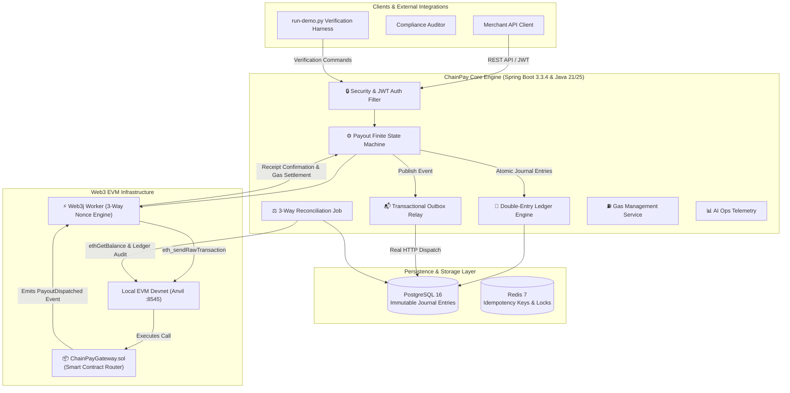
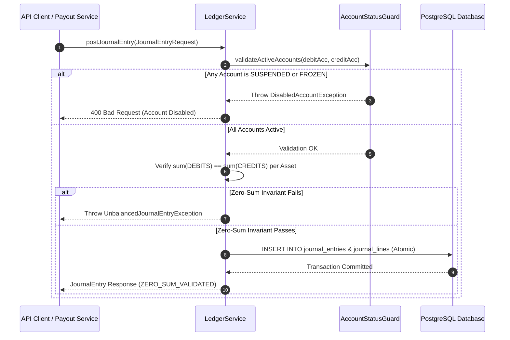
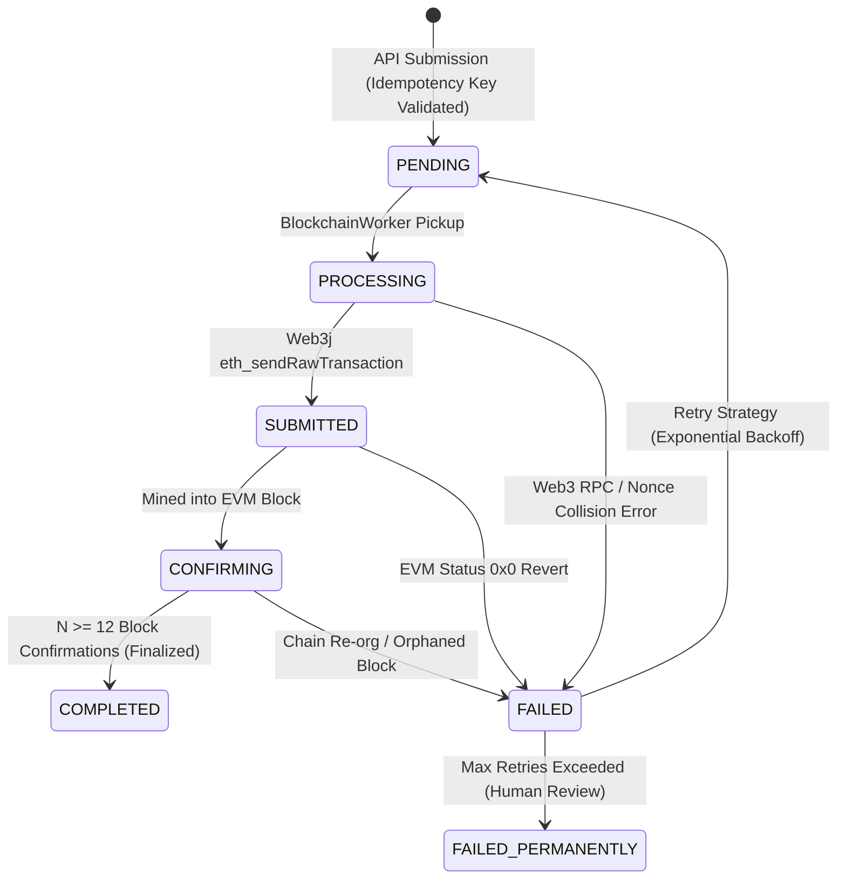
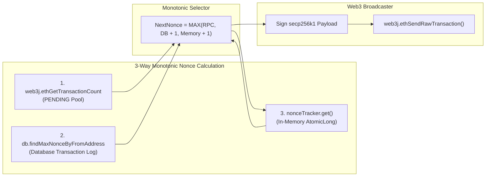
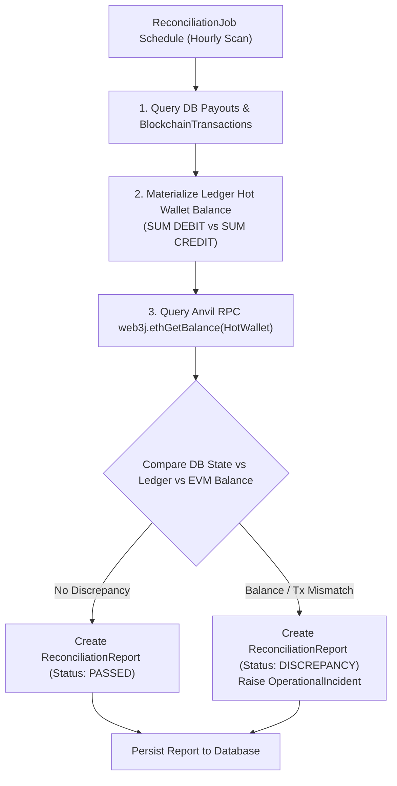
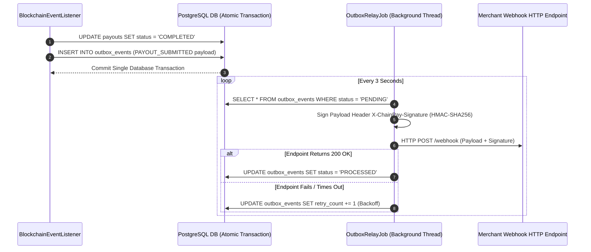

<div align="center">

# ⚡ ChainPay

> **Zero-Drift Web3 Settlement. Double-Entry Invariants. Atomic EVM Payouts.**

[](https://www.oracle.com/java/)
[](https://spring.io/projects/spring-boot)
[](build.gradle)
[](src/test/java)
[](https://www.postgresql.org/)
[](https://www.web3j.io/)
[](https://github.com/foundry-rs/foundry)
[](LICENSE)

*A high-throughput Web3 settlement engine combining immutable double-entry accounting, atomic EVM payouts, and automated on-chain reconciliation for stablecoin payment infrastructure.*

[📖 Architecture Playbook](docs/architecture-and-testing-guide.md) • [🚀 Quick Start](#-quick-start--local-deployment) • [⚡ Verification Harness](scripts/run-demo.py) • [🧪 Concurrency Suite](#-concurrency-benchmark--testing-suite) • [🔐 API Reference](#-api-reference-matrix) • [📜 Technical Roadmap](docs/chainpay-core-technical-roadmap.md)

</div>

---

## 📌 Summary & System Vision

**ChainPay** bridges the critical operational gap between traditional double-entry financial accounting and decentralized Ethereum Virtual Machine (EVM) blockchains.

In high-volume payment infrastructure, naive Web3 implementations treat blockchain settlements as isolated API calls wrapped around single-column balance updates (`UPDATE account SET balance = balance - amount`). Under concurrent workload conditions, this approach leads to catastrophic system failures:
- **Race conditions & overdrafts:** Concurrent debit requests execute against stale cached balances.
- **Mempool collisions & queue lockups:** Multi-threaded workers broadcast transactions with duplicate nonces, freezing wallet execution.
- **Gas fee drift & solvency loss:** Unaccounted on-chain gas costs silently erode ledger reserves.
- **Smart contract re-entrancy:** Unprotected fallback calls allow malicious contract recipients to drain funds.
- **State divergence on chain re-orgs:** Local database records mark payouts as completed even when on-chain blocks are orphaned.

**ChainPay eliminates these failure modes** by pairing an immutable double-entry ledger with an idempotent Payout Finite State Machine (FSM), a 3-way monotonic nonce engine, dynamic EIP-1559 gas price scaling, transactional outbox webhooks, and automated 3-way balance reconciliation.

---

## 📑 Table of Contents

1. [Executive Summary & System Vision](#-executive-summary--system-vision)
2. [System Architecture & Dataflow](#-system-architecture--dataflow)
3. [Double-Entry Financial Accounting Subsystem](#-double-entry-financial-accounting-subsystem)
4. [Payout Finite State Machine (FSM)](#-payout-finite-state-machine-fsm)
5. [EVM Execution Engine & Monotonic Nonce Management](#-evm-execution-engine--monotonic-nonce-management)
6. [Smart Contract Architecture (`ChainPayGateway.sol`)](#-smart-contract-architecture-chainpaygatewaysol)
7. [3-Way Reconciliation & Gas Cost Accounting](#-3-way-reconciliation--gas-cost-accounting)
8. [Transactional Outbox Pattern & Webhook Relay](#-transactional-outbox-pattern--webhook-relay)
9. [Autonomous Anomaly Detection & AI Ops Telemetry](#-autonomous-anomaly-detection--ai-ops-telemetry)
10. [Database Schema & Flyway Migrations](#-database-schema--flyway-migrations)
11. [Ecosystem & Technical Compatibility Matrix](#-ecosystem--technical-compatibility-matrix)
12. [Behind-The-Scenes Verification Harness (`run-demo.py`)](#-behind-the-scenes-verification-harness-run-demopy)
13. [Quick Start & Local Deployment](#-quick-start--local-deployment)
14. [Concurrency Benchmark & Testing Suite](#-concurrency-benchmark--testing-suite)
15. [API Reference Matrix](#-api-reference-matrix)
16. [License](#-license)

---

## 🏗 System Architecture & Dataflow

### High-Level Architecture Diagram



---

## 🏦 Double-Entry Financial Accounting Subsystem

ChainPay Core strictly prohibits single-column balance updates (`UPDATE account SET balance = ...`). Account balances are dynamically materialized from immutable journal entries.

### 1. Double-Entry Journal Posting Sequence



### 2. Mathematical Invariant Equations
Every transaction posted to ChainPay Core MUST satisfy the zero-sum invariant across every asset:

$$\sum \text{DEBITS}_{\text{asset}} = \sum \text{CREDITS}_{\text{asset}}$$

Running account balances are materialized on-demand using immutable journal lines:

$$\text{Account Balance} = \sum \text{CREDITS} - \sum \text{DEBITS}$$

```text
🔍  [BEHIND THE SCENES ENGINE ARCHITECTURE]
    │ ChainPay never uses single-column UPDATE balance queries.
    │ Account balances are dynamically materialized from immutable JournalEntry rows:
    │   Running Balance = SUM(CREDIT entries) - SUM(DEBIT entries)
    │ Zero-Sum Invariant: Every transaction enforces sum(DEBITS) == sum(CREDITS) per asset.
    └────────────────────────────────────────────────────────────────────
```

### 3. Multi-Asset Precision & Database Storage
All financial amounts are represented as `BigInteger` base units (wei for Native ETH, 6-decimal atomic units for ERC-20 USDC) and stored in PostgreSQL using `NUMERIC(38,0)` precision to eliminate floating-point rounding errors.

### 4. System & Customer Account Types
- `CUSTOMER_AVAILABLE`: Merchant or customer available liquid funds.
- `CUSTOMER_PENDING`: In-flight funds reserved during pending payout execution.
- `SYSTEM_HOT_WALLET`: Internal double-entry tracking account for key-management hot wallet reserves.
- `SYSTEM_GAS_FEE`: System expense account tracking cumulative EVM transaction gas fees.
- `MERCHANT_REVENUE`: Revenue settlement account.

### 5. Account Status Protection Guard
The ledger enforces that transactions can only be posted to accounts in `AccountStatus.ACTIVE` state. Attempts to post to `SUSPENDED` or `FROZEN` accounts raise a `DisabledAccountException`, aborting the database transaction.

---

## ⚙️ Payout Finite State Machine (FSM)

The lifecycle of every payout instruction is governed by an explicit Finite State Machine (`PayoutStateMachine`) enforced by database uniqueness constraints and state transitions.



### State Transition Matrix & Legal Paths

| Initial Status | Target Status | Triggering Component | Condition / Rationale |
|---|---|---|---|
| `PENDING` | `PROCESSING` | `BlockchainWorker` | Worker thread locks payout for broadcast |
| `PROCESSING` | `SUBMITTED` | `BlockchainWorker` | Transaction successfully accepted by EVM mempool |
| `SUBMITTED` | `CONFIRMING` | `BlockchainEventListener` | Transaction receipt mined with EVM status `0x1` |
| `CONFIRMING` | `COMPLETED` | `BlockchainEventListener` | Block depth reaches configured finality threshold ($N \ge 12$) |
| `PROCESSING` | `FAILED` | `BlockchainWorker` | RPC timeout or execution exception |
| `FAILED` | `PENDING` | `PayoutService` | Automated retry attempt ($N \le \text{maxRetries}$) |
| `FAILED` | `FAILED_PERMANENTLY` | `PayoutService` | Retry limit exhausted; manual operator intervention required |

---

## ⚡ EVM Execution Engine & Monotonic Nonce Management

### 1. 3-Way Monotonic Nonce Engine Flow



### 2. 3-Way Monotonic Nonce Calculation Algorithm
To guarantee thread-safe execution across multi-threaded workers without mempool nonce collisions, the engine computes nonces using a 3-way evaluation formula:

$$\text{NextNonce} = \max\left(\text{RPC Pending Count}, \text{DB Max Nonce} + 1, \text{Memory Nonce Tracker} + 1\right)$$

```text
🔍  [BEHIND THE SCENES ENGINE ARCHITECTURE]
    │ Behind-The-Scenes Payout Initialization:
    │   1. Idempotency-Key is persisted in Database Unique Index constraint.
    │   2. Payout entity saved with status PENDING.
    │   3. BlockchainWorker polls PENDING payouts, calculates 3-way monotonic nonce:
    │      NextNonce = MAX(RPC Pending Count, DB Max Nonce + 1, Memory Tracker + 1)
    │   4. Query live gas price from Web3j (web3j.ethGasPrice()).
    │   5. Sign secp256k1 RawTransaction payload with Hot Wallet Private Key.
    │   6. Broadcast raw hex string via web3j.ethSendRawTransaction() to Anvil node.
    └────────────────────────────────────────────────────────────────────
```

### 3. Dynamic EIP-1559 Gas Bumping & Calldata Preservation
When transactions remain stuck in the EVM mempool past the timeout threshold, `GasManagementService` executes a dynamic gas bump:

$$\text{NewGasPrice} = \left\lceil 1.15 \times \text{CurrentGasPrice} \right\rceil$$

Unlike basic wallet implementations that lose contract call data during gas bumping, ChainPay Core stores `calldata` and `valueSentWei` directly on `BlockchainTransaction` records (via Flyway migration `V3__add_blockchain_tx_calldata.sql`), enabling exact transaction re-broadcasting without discarding smart contract ABI execution payloads.

---

## 📦 Smart Contract Architecture (`ChainPayGateway.sol`)

The `ChainPayGateway.sol` smart contract serves as an enterprise router for bulk native ETH disbursements and ERC-20 transfers.

```text
🔍  [BEHIND THE SCENES ENGINE ARCHITECTURE]
    │ Behind-The-Scenes Batch Smart Contract Execution:
    │   1. Aggregates multiple payouts into a single transaction payload.
    │   2. Encodes ABI calldata for ChainPayGateway.sol's dispatchBatchPayout method.
    │   3. Executes transfers on-chain in a single atomic EVM transaction, saving gas fees.
    │   4. Smart contract emits indexed PayoutDispatched(bytes32 indexed payoutId, address indexed merchant, ...) logs.
    └────────────────────────────────────────────────────────────────────
```

### Key Security & Architectural Principles
1. **Re-entrancy Protection:** Inherits OpenZeppelin `ReentrancyGuard` applying `nonReentrant` modifiers on all public disbursement methods.
2. **Checks-Effects-Interactions:** Evaluates total `msg.value` constraints pre-loop to prevent unexpected execution halts or value shortages.
3. **Event Logging:** Emits indexed `PayoutDispatched` events:
   ```solidity
   event PayoutDispatched(
       bytes32 indexed payoutId,
       address indexed merchant,
       address indexed recipient,
       uint256 amount,
       string memo
   );
   ```
4. **Batch Execution:** `dispatchBatchPayout` aggregates up to 100 individual payouts into a single atomic EVM transaction, saving baseline `21,000` gas costs for every aggregated payout.

---

## ⚖️ 3-Way Reconciliation & Gas Cost Accounting

ChainPay Core features an automated background reconciliation job (`ReconciliationJob`) that periodically executes a 3-way balance and transaction audit across three distinct layers:



```text
🔍  [BEHIND THE SCENES ENGINE ARCHITECTURE]
    │ Behind-The-Scenes 3-Way Reconciliation Audit Flow:
    │   1. Compares local Database Payout records against Database BlockchainTransaction records.
    │   2. Queries Anvil RPC (web3j.ethGetBalance(hotWalletAddress)) to verify live on-chain ETH reserves.
    │   3. Audits SYSTEM_HOT_WALLET double-entry ledger balance against live EVM node balance.
    │   4. Persists an immutable ReconciliationReport entity to the database.
    └────────────────────────────────────────────────────────────────────
```

### Realized Gas Cost Accounting
When `BlockchainEventListener` detects that an EVM transaction has been mined in a block:
1. It queries `web3j.ethGetTransactionReceipt(txHash)` to retrieve exact `gasUsed`.
2. Calculates exact fee: $\text{TotalGasCostWei} = \text{gasUsed} \times \text{gasPrice}$.
3. Calls `GasCostAccountingService.settleGasFeeForPayout(...)` to post an explicit double-entry journal transaction:
   - **DEBIT**: `SYSTEM_GAS_FEE` account.
   - **CREDIT**: `SYSTEM_HOT_WALLET` account.

```text
🔍  [BEHIND THE SCENES ENGINE ARCHITECTURE]
    │ Behind-The-Scenes Confirmation Tracking:
    │   1. Anvil EVM node mines transaction into block.
    │   2. BlockchainEventListener background worker queries web3j.ethGetTransactionReceipt(txHash).
    │   3. Verifies EVM status code (0x1 = SUCCESS, 0x0 = REVERT).
    │   4. Calculates real block confirmations: RealConfirmations = CurrentBlock - MinedBlock + 1.
    │   5. FSM transitions: PENDING -> PROCESSING -> SUBMITTED -> CONFIRMING -> COMPLETED.
    │   6. Insert OutboxEvent record for transactional webhook broadcast.
    └────────────────────────────────────────────────────────────────────
```

---

## 📬 Transactional Outbox Pattern & Webhook Relay

To guarantee at-least-once webhook delivery to external merchant endpoints without distributed transaction deadlocks:

1. **Dual-Write Transaction:** When a payout state transitions (e.g., to `COMPLETED` or `FAILED`), an `OutboxEvent` entity is inserted within the *same* database transaction as the payout update.
2. **Asynchronous Relay Worker:** `OutboxRelayJob` polls unhandled outbox records, constructs the JSON payload, generates an `HMAC-SHA256` signature header (`X-ChainPay-Signature`), and executes a real HTTP POST request.
3. **Resilient Retry Handling:** If the target endpoint returns a non-2xx status code, the outbox entry retry counter increments with exponential backoff.



---

## 📊 Autonomous Anomaly Detection & AI Ops Telemetry

ChainPay Core includes an automated anomaly detection daemon (`AnomalyDetectionService`) and AI Ops Telemetry system:

- **Autonomous Scans:** Scans every 60 seconds for stuck in-flight payouts ($T > 15 \text{ mins}$ in `PROCESSING` or `SUBMITTED`), orphaned blockchain transactions, and ledger zero-sum imbalances.
- **Incident Persistence:** Automatically creates `OperationalIncident` entities when system drift or anomalies are detected.
- **REST Telemetry:** Exposes read-only operational telemetry at `/api/v1/copilot/summary` and `/api/v1/health` for monitoring and LLM diagnostic tools.

---

## 🗄 Database Schema & Flyway Migrations

Database DDL migrations are managed version-by-version using **Flyway**:

- `V1__init_schema.sql`: Core relational schemas for `accounts`, `assets`, `journal_entries`, `journal_lines`, `payouts`, `payout_status_history`, `blockchain_transactions`, and `outbox_events`.
- `V2__add_reconciliation_reports.sql`: Audit table structures for 3-way reconciliation reporting.
- `V3__add_blockchain_tx_calldata.sql`: Schema upgrade adding `calldata TEXT` and `value_sent_wei NUMERIC(38,0)` to `blockchain_transactions` for calldata-preserving gas bumps.

---

## 🌐 Ecosystem & Technical Compatibility Matrix

| Subsystem Component | Supported Standard / Tech | Tested Version | Integration & Purpose |
| :--- | :--- | :--- | :--- |
| **Language Runtime** | Java OpenJDK | Java 21 LTS / 25 | Virtual Threads (Project Loom) & pattern matching |
| **Framework Layer** | Spring Boot | 3.3.4 | `@Transactional` boundary, Security, Data JPA |
| **Web3 EVM Client** | Web3j Client | 4.10.3 | Web3 RPC, secp256k1 signing, ABI FunctionEncoder |
| **Relational Database**| PostgreSQL | 16.0+ | Flyway migrations, `NUMERIC(38,0)` ledger math |
| **Distributed Caching**| Redis / Jedis | 7.2+ | Distributed locks, idempotency key TTL tracking |
| **EVM Local Devnet** | Foundry Anvil | 0.2.0+ | Instant EVM block mining on `http://127.0.0.1:8545` |
| **Smart Contracts** | Solidity / OpenZeppelin | 0.8.20 | `ChainPayGateway.sol` contract deployment via Forge |

---

## 🖥 Behind-The-Scenes Verification Harness (`run-demo.py`)

ChainPay Core includes an interactive, 7-step verification harness ([scripts/run-demo.py](scripts/run-demo.py)) that executes all payment subsystems on a live local Anvil EVM node.

### Verification Execution Summary

```text
============================================================================
      ⚡ CHAINPAY CORE — WEB3 PAYMENT & SETTLEMENT ENGINE SHOWCASE ⚡     
============================================================================
  • Core Engine Architecture : Java 21/25 · Spring Boot 3.3.4 · PostgreSQL 16 · Redis 7
  • EVM RPC Node Integration : Web3j Client -> Anvil Local Devnet (http://127.0.0.1:8545)
  • Hot Wallet Address (KMS) : 0xf39Fd6e51aad88F6F4ce6aB8827279cffFb92266 (Account #0)
  • Financial Solvency Model : Immutable Double-Entry Ledger [NUMERIC(38,0) wei]
============================================================================

============================================================================
  🔒 1. SECURITY & JWT TOKEN AUTHENTICATION
============================================================================
  ✅  [VERIFIED]  JWT Authentication credential verified successfully
  ℹ️   Authenticated Username          : admin
  ℹ️   Granted Security Role           : ADMIN
  ℹ️   Token Cryptographic Scheme      : HMAC-SHA256 (JJWT)
  ℹ️   Token Expiration Window         : 24 Hours (86,400,000 ms)

============================================================================
  🏦 2. DOUBLE-ENTRY LEDGER & EVM NODE DISCOVERY
============================================================================
  ℹ️   Double-Entry Invariant Status   : ZERO_SUM_INVARIANT_VALIDATED
  ℹ️   EVM RPC Node Connection         : CONNECTED
  ℹ️   Anvil RPC URL Endpoint          : http://localhost:8545 (Chain ID: 31337)
  ℹ️   Current Anvil Block Height      : Block #16
  ✅  [VERIFIED]  Discovered Customer Account: ACC-CUSTOMER-ETH-001

============================================================================
  💳 3. SINGLE NATIVE ETH PAYOUT SUBMISSION
============================================================================
  ✅  [VERIFIED]  Payout instruction accepted by Payout Finite State Machine
  ℹ️   Payout Instruction UUID         : a06c158d-90f6-4f2e-9d92-9b26a984aa43
  ℹ️   Initial FSM Status              : PENDING
  ℹ️   Hot Wallet Sender Address       : 0xf39Fd6e51aad88F6F4ce6aB8827279cffFb92266
  ℹ️   Recipient Destination Address   : 0x70997970C51812dc3A010C7d01b50e0d17dc79C8
  ℹ️   Transfer Amount (Formatted)     : 0.5 ETH

============================================================================
  ⚙️ 4. FINITE STATE MACHINE & REAL EVM BLOCK CONFIRMATION
============================================================================
  [INFO]   Polling status machine until block receipt confirmation...
  ℹ️   FSM State Poll T+2s             : Current Status: PENDING
  ℹ️   FSM State Poll T+4s             : Current Status: SUBMITTED
  ℹ️   FSM State Poll T+6s             : Current Status: CONFIRMING
  ✅  [VERIFIED]  Transaction mined into Anvil block! Status advanced to: CONFIRMING

============================================================================
  📦 5. BATCH PAYOUT DISPATCH VIA GATEWAY SMART CONTRACT
============================================================================
  ✅  [VERIFIED]  Batch dispatch submitted to ChainPayGateway.sol router contract
  ℹ️   Target Gateway Contract         : 0x5FbDB2315678afecb367f032d93F642f64180aa3
  📐  Batch Payout Items Processed      : 2
  📐  Batch Execution Status            : SUCCESS

============================================================================
  ⚖️ 6. 3-WAY FINANCIAL LEDGER & ON-CHAIN RECONCILIATION AUDIT
============================================================================
  ✅  [VERIFIED]  Automated 3-way financial & EVM node reconciliation audit complete
  📐  Audit Report Status               : PASSED
  📐  Discrepancies Detected            : 0

============================================================================
  📊 7. SYSTEM TELEMETRY & OPERATIONAL HEALTH SUMMARY
============================================================================
  📐  Total System Accounts             : 3
  📐  Total On-Chain Tx Records         : 4
  📐  Latest Reconciliation Audit       : PASSED

============================================================================
 ✅  SUMMARY: ALL CHAINPAY CORE SUBSYSTEM VERIFICATIONS PASSED SUCCESSFULLY 
============================================================================
```

---

## ⚡ Quick Start & Local Deployment

### Option A: Local Devnet & Gradle Setup

1. **Start Local Anvil EVM Node**:
   ```bash
   anvil
   ```

2. **Deploy `ChainPayGateway.sol` Router Contract**:
   ```bash
   forge create contracts/ChainPayGateway.sol:ChainPayGateway \
     --rpc-url http://localhost:8545 \
     --private-key 0xac0974bec39a17e36ba4a6b4d238ff944bacb478cbed5efcae784d7bf4f2ff80 \
     --broadcast
   ```

3. **Start ChainPay Core Backend Engine**:
   ```bash
   ./gradlew bootRun --args='--spring.profiles.active=test'
   ```

4. **Run End-to-End Verification Harness**:
   ```bash
   python3 scripts/run-demo.py
   ```

---

### Option B: Turnkey Container Stack (1-Command Docker Deployment)

Launch PostgreSQL 16, Redis 7, Anvil EVM, Contract Auto-Deployer, and ChainPay Core seamlessly:

```bash
docker compose up --build
```

Then run the interactive verification harness in a separate terminal:

```bash
python3 scripts/run-demo.py
```

> [!TIP]
> Interactive OpenAPI / Swagger UI documentation is live at: `http://localhost:8080/swagger-ui.html`

---

## 🧪 Concurrency Benchmark & Testing Suite

ChainPay Core includes an automated test suite verifying ledger integrity, concurrency controls, and architecture governance rules:

```bash
./gradlew test --rerun-tasks
```

### Test Suite Highlights
- **`ChainPayLoadBenchmarkTest`**: Executes 20 parallel threads posting simultaneous debit/credit entries, confirming zero-sum invariant holds 100% under high concurrent write pressure.
- **`ArchitectureGovernanceTest`**: Enforces strict package-by-feature boundary isolation and domain encapsulation via ArchUnit rules.
- **`LedgerServiceTest`**: Validates balanced multi-asset journal entries pass while unbalanced transactions or inactive accounts are rejected.
- **`PayoutStateMachineTest`**: Tests legal and illegal state machine transitions across all 7 statuses.
- **`ReconciliationJobTest`**: Verifies 3-way balance mismatch detection between double-entry ledger and live Web3 node balances.

---

## 🔐 API Reference Matrix

| Category | Method | Endpoint | Description | Idempotent |
| :--- | :--- | :--- | :--- | :---: |
| **Auth** | `POST` | `/api/v1/auth/login` | Authenticate operator & obtain JWT token | No |
| **Auth** | `POST` | `/api/v1/auth/register` | Register new user account | No |
| **Ledger** | `POST` | `/api/v1/accounts` | Create system or customer double-entry account | Yes |
| **Ledger** | `GET` | `/api/v1/accounts/lookup/{accountNumber}` | Look up account details by account number | Yes |
| **Ledger** | `GET` | `/api/v1/accounts/{id}/balance` | Query derived account balance in base units | Yes |
| **Ledger** | `POST` | `/api/v1/accounts/transactions` | Post balanced multi-line journal transaction | Yes |
| **Payouts** | `POST` | `/api/v1/payouts` | Submit single payout (Requires `Idempotency-Key`) | Yes |
| **Payouts** | `POST` | `/api/v1/payouts/batch` | Submit bulk payout request to Gateway contract | Yes |
| **Payouts** | `GET` | `/api/v1/payouts/{id}` | Query payout details, state, & confirmation height | Yes |
| **Payouts** | `POST` | `/api/v1/payouts/{id}/retry` | Manually retry failed payout | No |
| **Reconcile**| `POST` | `/api/v1/reconciliation/trigger` | Trigger immediate 3-way financial & Web3 audit | No |
| **Audit** | `GET` | `/api/v1/audit/export?format=CSV` | Export immutable compliance audit logs (CSV/JSON) | Yes |
| **Ops** | `GET` | `/api/v1/copilot/summary` | Read-only AI Ops Copilot telemetry summary | Yes |
| **Health** | `GET` | `/api/v1/health` | System diagnostics (Ledger integrity & Web3 node status) | Yes |

---

## 📄 License

This project is licensed under the MIT License — see the [LICENSE](LICENSE) file for details.
