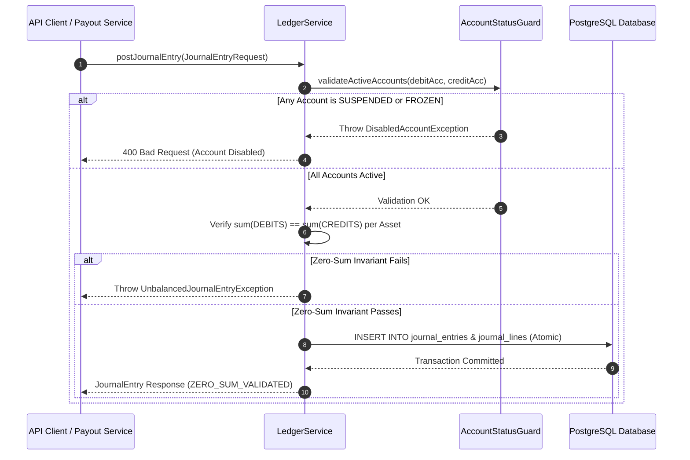
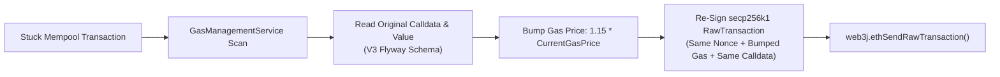
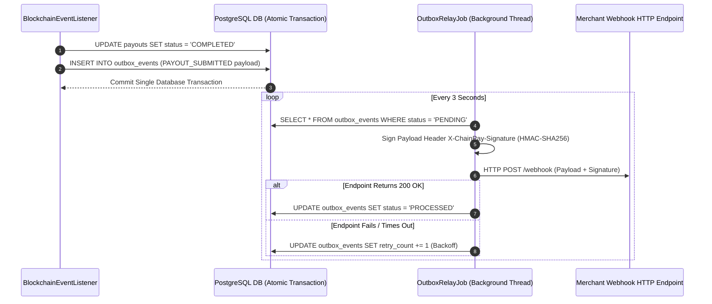
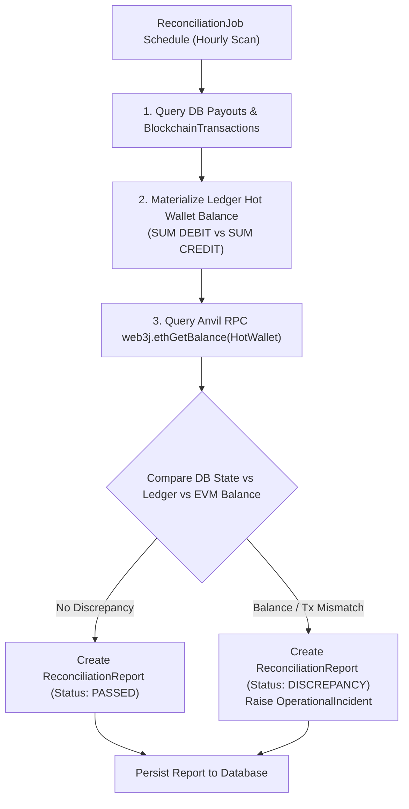

# ChainPay — Master Architecture & Technical Playbook

This master guide provides an exhaustive technical specification of **ChainPay**, detailing end-to-end data paths, mathematical invariants, database schemas, sequence diagrams, and step-by-step testing instructions.

---

## 🏛 1. High-Level Architecture Overview

```
                      +---------------------------------------+
                      |   Client / API / WebSockets (STOMP)   |
                      +-------------------+-------------------+
                                          | (REST / JWT / WS)
                                          v
                      +-------------------+-------------------+
                      |     Security & Auth Filter (JJWT)     |
                      +-------------------+-------------------+
                                          |
        +---------------------------------+---------------------------------+
        |                                 |                                 |
        v                                 v                                 v
+-------+-------+                 +-------+-------+                 +-------+-------+
| Account API   |                 | Payout API    |                 | Ops & Copilot |
| Controller    |                 | Controller    |                 | Controller    |
+-------+-------+                 +-------+-------+                 +-------+-------+
        |                                 |                                 |
        v                                 v                                 v
+-------+-------+                 +-------+-------+                 +-------+-------+
| Ledger        |                 | Payout State  |                 | Anomaly Detect|
| Service       |                 | Machine (FSM) |                 | & AI Tools    |
+-------+-------+                 +-------+-------+                 +-------+-------+
        |                                 |                                 |
        |  sum(DEBIT) == sum(CREDIT)      v                                 v
        |  +----------------------+--------------------+                    |
        |  | Outbox Publisher     | Blockchain Worker  |                    |
        |  | (Transactional)      | (Web3j EVM Signer) |                    |
        |  +----------+-----------+---------+----------+                    |
        |             |                     |                               |
        v             v                     v                               v
+-------+-------------+---------------------+-------------------------------+-------+
|                          PostgreSQL 16 Database                                   |
|   (Accounts, JournalEntries, LedgerTransactions, Payouts, OutboxEvents, Incidents) |
+-----------------------------------------------------------------------------------+
```

---

## 🔄 2. End-to-End Data Paths & Subsystem Tracing

### Data Path 1: Multi-Asset Double-Entry Ledger Subsystem

When a financial transaction is posted via `POST /api/v1/accounts/transactions`:



1. **Authentication & Authorization**:
   - `JwtAuthenticationFilter.java` validates HMAC-SHA256 signature on incoming Bearer JWT tokens.
   - `@PreAuthorize("hasAnyRole('ADMIN', 'OPERATOR')")` on `AccountController.java` validates caller permissions.

2. **Double-Entry Zero-Sum Invariant Validation**:
   - `LedgerService.java` (`postTransaction` method) receives `PostTransactionRequest` containing entry lines.
   - Enforces the zero-sum invariant across every asset:
     $$\sum \text{DEBITS}_{\text{asset}} = \sum \text{CREDITS}_{\text{asset}}$$
   - If debits != credits, throws `UnbalancedTransactionException` and aborts the database transaction.

3. **Account Status Protection Guard**:
   - `AccountStatusGuard.java` verifies all accounts involved are in `ACTIVE` state.
   - Attempts to post to `SUSPENDED` or `FROZEN` accounts raise `DisabledAccountException`.

4. **Dynamic Balance Materialization**:
   - Balances are derived on-demand using immutable journal entries stored in PostgreSQL with `NUMERIC(38,0)` precision:
     $$\text{Running Balance} = \sum \text{CREDIT entries} - \sum \text{DEBIT entries}$$

---

### Data Path 2: Idempotent Payout FSM & EVM Execution

When a client submits a blockchain payout request via `POST /api/v1/payouts`:

```
[ POST /payouts ] ──> [ PayoutService ] ──> [ PayoutStateMachine: PENDING ]
                                                     │
                                                     ▼
                                            [ OutboxPublisher ]
                                                     │
                                                     ▼
                                         [ BlockchainWorker (Web3j) ]
                                                     │
                                                     ▼ (EVM RPC Broadcast)
                                          [ Status: SUBMITTED ]
                                                     │
                                                     ▼ (N=12 Confirmations)
                                      [ BlockchainEventListener ]
                                                     │
                                                     ▼
                                          [ Status: COMPLETED ]
                                                     │
                                                     ▼
                                         [ OutboxRelayJob Webhook ]
```

1. **Idempotency Protection**:
   - `PayoutService.java` evaluates `Idempotency-Key` header against database unique index (`payouts.idempotency_key`).

2. **State Machine Initialization (`PENDING`)**:
   - `PayoutStateMachine.java` validates transition (`null → PENDING`) and creates `Payout` entity with `status = PENDING`.

3. **Transactional Outbox Dual-Write**:
   - `OutboxPublisherService.java` appends `OutboxEvent` with `PAYOUT_CREATED` in the **same database transaction**.

4. **3-Way Monotonic Nonce & EVM Signing (`SUBMITTED`)**:
   - Scheduled `BlockchainWorker.java` polls `PENDING` payouts.
   - Calculates monotonic nonce:
     $$\text{NextNonce} = \max\Big(\text{RPC Pending Count}, \; \text{DB Max Nonce} + 1, \; \text{Memory Tracker} + 1\Big)$$
   - Signs secp256k1 RawTransaction payload with Hot Wallet Private Key and broadcasts raw hex via `web3j.ethSendRawTransaction()`.
   - Transitions status (`PENDING → PROCESSING → SUBMITTED`) and saves `BlockchainTransaction` with encoded `calldata` and `valueSentWei`.

5. **Inbound Confirmation & Realized Gas Settlement (`COMPLETED`)**:
   - `BlockchainEventListener.java` queries block receipt confirmations ($\text{Confirmations} = \text{CurrentBlock} - \text{MinedBlock} + 1$).
   - When confirmations $\ge 12$, transitions status to `COMPLETED`.
   - Calls `GasCostAccountingService.java` to post exact realized gas fee ($\text{gasUsed} \times \text{gasPrice}$) as a double-entry debit to `SYSTEM_GAS_FEE`.

---

### Data Path 3: EIP-1559 Dynamic Gas Bumping & Calldata Preservation

When a transaction is stuck in the EVM mempool past the configured timeout threshold:



1. **Stuck Transaction Detection**:
   - `GasManagementService.java` scans for transactions in `SUBMITTED` state where elapsed time exceeds the mempool timeout window.

2. **Calldata & Value Retrieval**:
   - Queries `BlockchainTransaction` for `calldata` and `valueSentWei` persisted by Flyway migration `V3__add_blockchain_tx_calldata.sql`.

3. **Gas Price Bumping**:
   - Queries `web3j.ethGasPrice()` and scales the gas price by $1.15 \times$:
     $$\text{NewGasPrice} = \left\lceil 1.15 \times \text{CurrentGasPrice} \right\rceil$$

4. **Re-broadcasting Payload**:
   - Re-creates `RawTransaction` using the **same nonce**, bumped `gasPrice`, and **original `calldata`**, ensuring contract ABI calls (e.g. `dispatchBatchPayout` or `transfer`) are never lost during gas bumping.

---

### Data Path 4: Transactional Outbox Pattern & Webhook Relay

To guarantee at-least-once webhook delivery without distributed transaction locks:



---

### Data Path 5: 3-Way Financial & Web3 Reconciliation



---

## 🗄 3. Database Schemas & Flyway DDL Migrations

The database structure is governed by Flyway versioned DDL scripts:

### Table `accounts`
- `id` (UUID, Primary Key)
- `account_number` (VARCHAR, Unique Constraint)
- `type` (VARCHAR: `CUSTOMER_AVAILABLE`, `CUSTOMER_PENDING`, `SYSTEM_HOT_WALLET`, `SYSTEM_GAS_FEE`, `MERCHANT_REVENUE`)
- `status` (VARCHAR: `ACTIVE`, `SUSPENDED`, `FROZEN`)
- `created_at` (TIMESTAMP WITH TIME ZONE)

### Table `assets`
- `id` (UUID, Primary Key)
- `symbol` (VARCHAR, Unique Constraint: `ETH`, `USDC`, `USDT`)
- `decimals` (INT)
- `contract_address` (VARCHAR, Nullable for Native ETH)

### Table `journal_entries`
- `id` (UUID, Primary Key)
- `transaction_id` (UUID)
- `entry_date` (TIMESTAMP WITH TIME ZONE)
- `description` (VARCHAR)

### Table `journal_lines`
- `id` (UUID, Primary Key)
- `journal_entry_id` (UUID, Foreign Key)
- `account_id` (UUID, Foreign Key)
- `asset_id` (UUID, Foreign Key)
- `entry_type` (VARCHAR: `DEBIT`, `CREDIT`)
- `amount` (NUMERIC(38,0), Wei / Atomic Units)

### Table `payouts`
- `id` (UUID, Primary Key)
- `idempotency_key` (VARCHAR, Unique Constraint)
- `account_id` (UUID, Foreign Key)
- `asset_id` (UUID, Foreign Key)
- `destination_address` (VARCHAR)
- `amount` (NUMERIC(38,0))
- `status` (VARCHAR: `PENDING`, `PROCESSING`, `SUBMITTED`, `CONFIRMING`, `COMPLETED`, `FAILED`, `FAILED_PERMANENTLY`)

### Table `blockchain_transactions`
- `id` (UUID, Primary Key)
- `payout_id` (UUID, Foreign Key)
- `tx_hash` (VARCHAR, Unique Constraint)
- `from_address` (VARCHAR)
- `to_address` (VARCHAR)
- `nonce` (BIGINT)
- `gas_price` (NUMERIC(38,0))
- `gas_limit` (NUMERIC(38,0))
- `gas_used` (NUMERIC(38,0))
- `calldata` (TEXT, Added in V3 Flyway Migration)
- `value_sent_wei` (NUMERIC(38,0), Added in V3 Flyway Migration)
- `status` (VARCHAR: `SUBMITTED`, `CONFIRMED`, `FAILED`)

---

## 🧪 4. System Verification & Testing Playbook

### Step 1: Execute Automated Unit & Benchmark Test Suite
Run the full test suite from the project root:

```bash
./gradlew test
```

#### Key Verified Test Classes:
* **`ChainPayLoadBenchmarkTest`**: Executes 20 parallel threads posting simultaneous debit/credit entries, confirming zero-sum invariant holds 100% under concurrent write pressure.
* **`ArchitectureGovernanceTest`**: Enforces strict package-by-feature boundary isolation and domain encapsulation via ArchUnit rules.
* **`LedgerServiceTest`**: Validates balanced multi-asset journal entries pass while unbalanced transactions or inactive accounts are rejected.
* **`PayoutStateMachineTest`**: Tests legal and illegal state machine transitions across all 7 statuses.
* **`ReconciliationJobTest`**: Verifies 3-way balance mismatch detection between double-entry ledger and live Web3 node balances.

---

### Step 2: Execute Interactive End-to-End Verification Harness
To verify all 7 payment subsystems on a live local Anvil devnet:

```bash
python3 scripts/run-demo.py
```
