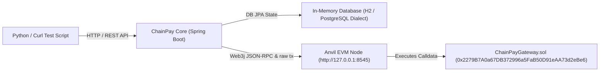

# ChainPay Core — Local Anvil EVM Testnet End-to-End Execution Guide

This document is the definitive operational manual for running, testing, and debugging **ChainPay Core** against a local **Anvil** Ethereum Virtual Machine (EVM) node on your local system without Docker or external cloud services.

---

## 📌 1. Architecture Overview

When running locally, ChainPay operates with three primary interconnected components:



1. **Anvil EVM Node (`http://127.0.0.1:8545`)**: Runs local blockchain, mines blocks, and executes Solidity smart contracts.
2. **ChainPay Gateway Smart Contract (`ChainPayGateway.sol`)**: Deployed on Anvil, receives payout transfers, and emits indexed on-chain `PayoutDispatched` event logs.
3. **ChainPay Engine (Java 21/25 Spring Boot)**: Handles JWT auth, double-entry ledger postings, Web3j secp256k1 signing, dynamic nonce management, and real EVM receipt confirmation tracking.

---

## 🛠 2. Prerequisites & Toolchain Verification

Run these verification commands in your shell before starting:

```bash
java -version       # Required: Java 21 or Java 25
anvil --version      # Required: Foundry Anvil (1.5.1+)
forge --version      # Required: Foundry Forge CLI
python3 --version    # Required: Python 3.10+
```

---

## 🚀 3. Standard Step-by-Step Manual Execution Process

### Step 1: Start the Local Anvil EVM Node

Open **Terminal 1** and run:

```bash
anvil
```

#### What to Expect in Terminal 1 Output:
```text
                             _   _
                            (_) | |
      __ _   _ __   __   __  _  | |
     / _` | | '_ \  \ \ / / | | | |
    | (_| | | | | |  \ V /  | | | |
     \__,_| |_| |_|   \_/   |_| |_|

    1.5.1-stable

Available Accounts
==================
(0) 0xf39Fd6e51aad88F6F4ce6aB8827279cffFb92266 (10000.000000000000000000 ETH)
(1) 0x70997970C51812dc3A010C7d01b50e0d17dc79C8 (10000.000000000000000000 ETH)

Private Keys
==================
(0) 0xac0974bec39a17e36ba4a6b4d238ff944bacb478cbed5efcae784d7bf4f2ff80

Listening on 127.0.0.1:8545
```

#### What NOT to Expect:
- Do not close or terminate this process while testing.
- Anvil mines blocks on demand (whenever a transaction is broadcasted).

---

### Step 2: Deploy `ChainPayGateway.sol` Smart Contract to Anvil

Open **Terminal 2** and run `forge create` to compile and deploy the payment router contract onto Anvil:

```bash
forge create contracts/ChainPayGateway.sol:ChainPayGateway \
  --rpc-url http://localhost:8545 \
  --private-key 0xac0974bec39a17e36ba4a6b4d238ff944bacb478cbed5efcae784d7bf4f2ff80 \
  --broadcast
```

#### What to Expect in Terminal 2 Output:
```text
Compiling 1 files with Solc 0.8.20
Compiler run successful!
Deployer: 0xf39Fd6e51aad88F6F4ce6aB8827279cffFb92266
Deployed to: 0x2279B7A0a67DB372996a5FaB50D91eAA73d2eBe6
Transaction hash: 0xd134f4045a0b6076d3ac87602efa7be3beb414603d21d3e5e4f3bed9da0e3827
```

> [!IMPORTANT]
> The deployed contract address is `0x2279B7A0a67DB372996a5FaB50D91eAA73d2eBe6`. This address is pre-configured in `application-test.yml`.

---

### Step 3: Launch ChainPay Core Server in Test Profile

In **Terminal 2**, start the Spring Boot engine using the local `test` profile:

```bash
./gradlew bootRun --args='--spring.profiles.active=test'
```

#### What to Expect in Server Startup Logs:
Look for these key log lines confirming successful initialization and seed data generation:

```log
2026-09-01T03:37:28.168+05:30 INFO [chainpay-core] com.chainpay.core.ChainPayApplication : Started ChainPayApplication in 3.856 seconds
2026-09-01T03:37:28.294+05:30 INFO [chainpay-core] com.chainpay.core.config.DataSeeder   : Seeded default admin user (username: admin)
2026-09-01T03:37:28.369+05:30 INFO [chainpay-core] com.chainpay.core.config.DataSeeder   : Seeded default Assets: USDC (ID: 068fba95-cbfd-4cdf-acee-201f86a63535) and Native ETH (ID: 056d8e17-0847-4ad1-b686-2197c9afe327)
2026-09-01T03:37:28.369+05:30 INFO [chainpay-core] com.chainpay.core.config.DataSeeder   : Seeded default Accounts: Customer USDC (ID: f74ae1dc-664a-42d2-b3fc-99a53f216b64), Customer ETH (ID: 1475e992-31ee-46ed-82d9-f347f0c4a980), and Hot Wallet (ID: e97153bf-612a-457f-8c5d-d66eb01a5337)
```

---

## 🧪 4. End-to-End Automated Testing Script (Python)

Create or run the following complete Python test script (`test_flow.py`) in **Terminal 3**. This script executes authentication, submits Native ETH payouts through `ChainPayGateway.sol`, tracks state machine progress, and queries telemetry.

```python
import urllib.request
import json
import time

BASE_URL = "http://localhost:8080/api/v1"

print("==========================================================")
print("🚀 STEP 1: Authenticating with ChainPay JWT Auth Service...")
print("==========================================================")

login_payload = json.dumps({"username": "admin", "password": "admin123"}).encode()
req = urllib.request.Request(
    f"{BASE_URL}/auth/login",
    data=login_payload,
    headers={"Content-Type": "application/json"}
)

with urllib.request.urlopen(req) as resp:
    auth_resp = json.loads(resp.read())
    token = auth_resp["accessToken"]
    print("✅ Authentication Successful!")
    print("   User Role:   ", auth_resp["role"])
    print("   JWT Token:   ", token[:20] + "...")

headers = {
    "Content-Type": "application/json",
    "Authorization": f"Bearer {token}"
}

print("\n==========================================================")
print("💳 STEP 2: Submitting Payout via ChainPayGateway Smart Contract...")
print("==========================================================")

# Query Accounts to get Customer ETH Account UUID
acc_req = urllib.request.Request(f"{BASE_URL}/copilot/summary", headers=headers)
with urllib.request.urlopen(acc_req) as resp:
    summary = json.loads(resp.read())
    print("   Current Accounts Registered:", summary["totalAccounts"])

# Submit Native ETH Payout
payout_payload = json.dumps({
    "accountId": "1475e992-31ee-46ed-82d9-f347f0c4a980", # Replace with your seeded Customer ETH Account ID
    "assetId": "056d8e17-0847-4ad1-b686-2197c9afe327",     # Replace with your seeded Native ETH Asset ID
    "destinationAddress": "0x70997970C51812dc3A010C7d01b50e0d17dc79C8",
    "amount": 500000000000000000 # 0.5 ETH in Wei
}).encode()

payout_headers = dict(headers)
payout_headers["Idempotency-Key"] = f"idemp-gw-{int(time.time())}"

payout_req = urllib.request.Request(f"{BASE_URL}/payouts", data=payout_payload, headers=payout_headers)
with urllib.request.urlopen(payout_req) as resp:
    payout = json.loads(resp.read())
    payout_id = payout["id"]
    print("✅ Payout Submitted Successfully!")
    print("   Payout UUID:         ", payout_id)
    print("   Initial State:       ", payout["status"])
    print("   Destination Address: ", payout["destinationAddress"])
    print("   Amount (Wei):        ", payout["amount"])

print("\n==========================================================")
print("⚙️ STEP 3: Tracking Pipeline FSM & Real EVM Confirmations...")
print("==========================================================")

for i in range(6):
    time.sleep(3)
    get_req = urllib.request.Request(f"{BASE_URL}/payouts/{payout_id}", headers=headers)
    with urllib.request.urlopen(get_req) as resp:
        res = json.loads(resp.read())
        status = res["status"]
        print(f"   [T+{(i+1)*3}s] Payout FSM Status: {status}")
        if status == "COMPLETED":
            print("\n🎉 Payout Accrued Real Block Confirmations and reached COMPLETED state!")
            break

print("\n==========================================================")
print("📊 STEP 4: Fetching Copilot System Summary & Telemetry...")
print("==========================================================")

summary_req = urllib.request.Request(f"{BASE_URL}/copilot/summary", headers=headers)
with urllib.request.urlopen(summary_req) as resp:
    summary = json.loads(resp.read())
    print("✅ Copilot Telemetry Output:")
    print(json.dumps(summary, indent=2))
```

---

## 🔍 5. Reading Anvil Terminal Logs

When the Python test script executes a payout, observe **Terminal 1** (Anvil). You will see real-time RPC calls and smart contract event emissions:

### Smart Contract Call (`dispatchNativePayout`):
```text
eth_sendRawTransaction

    Transaction: 0xfaf9fd8a95ef0c7f332893c268d9bb67a291cf6626ae60397fd37f7dd12081ba
    Contract: null
    From: 0xf39Fd6e51aad88F6F4ce6aB8827279cffFb92266
    To: 0x2279B7A0a67DB372996a5FaB50D91eAA73d2eBe6 (ChainPayGateway)
    Value: 500000000000000000 wei
    Gas Used: 55431

    Block Number: 10
    Block Hash: 0x9cfc582988ae7a3590700addac3a613e155be59e8311f8e02a04f498dc789dfe

    Events:
      PayoutDispatched(
        payoutId: 0x3263653362656631...,
        merchant: 0xf39Fd6e51aad88F6F4ce6aB8827279cffFb92266,
        asset: 0x0000000000000000000000000000000000000000,
        recipient: 0x70997970C51812dc3A010C7d01b50e0d17dc79C8,
        amount: 500000000000000000,
        memo: "CHAINPAY:2ce3bef1-de4e-46e0-83f6-5c4b2fe74844"
      )
```

---

## ⚡ 6. Troubleshooting & Common Gotchas

### 1. `RPC Error: Transaction rejected: nonce too low`
- **Cause**: EVM account nonces must strictly increment ($0, 1, 2, \dots$). If the server restarts while Anvil is already at Nonce #10, an old nonce attempt will be rejected.
- **Fix**: ChainPay uses bulletproof 3-way monotonic nonce calculation:
  $$\text{NextNonce} = \max\Big(\text{RPC Pending Count}, \; \text{DB Max Nonce} + 1, \; \text{Memory Tracker} + 1\Big)$$

### 2. Payout Status Remains `CONFIRMING`
- **Cause**: Anvil only mines a block when a new transaction is broadcasted or when `anvil_mine` is called via RPC. If `confirmations-required` is set to `2` in `application-test.yml`, the status will remain `CONFIRMING` until 1 more block is mined.
- **Fix**: Send a second test transaction or execute `curl -H "Content-Type: application/json" -X POST --data '{"jsonrpc":"2.0","method":"anvil_mine","params":[1],"id":1}' http://localhost:8545` to manually advance Anvil's block height.

### 3. Seed Data UUID Mismatch Upon Restart
- **Cause**: The test profile uses in-memory H2 DB (`jdbc:h2:mem:...`), which re-generates UUIDs on each application restart.
- **Fix**: Always check the startup logs in Terminal 2 to obtain the newly seeded `Customer Account ID` and `Asset ID` before making `POST /api/v1/payouts` requests.
