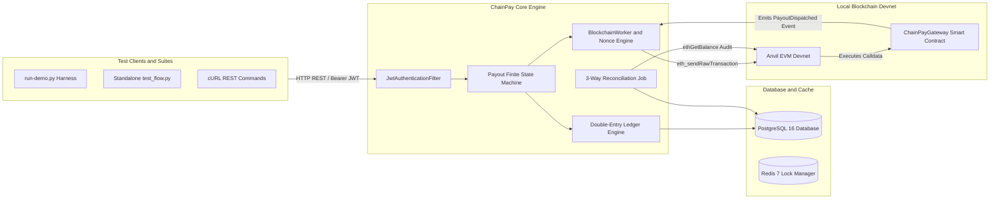

# ChainPay — Local Anvil EVM Testnet End-to-End Execution & Debugging Manual

This document is the master operational manual for setting up, running, testing, and debugging **ChainPay** against a local **Anvil** Ethereum Virtual Machine (EVM) devnet node on your local machine without external cloud dependencies.

---

## 📌 1. Complete Architecture Overview

When running locally, ChainPay operates with three primary interconnected components:



1. **Anvil EVM Node (`http://127.0.0.1:8545`)**: Runs local blockchain state, mines blocks on-demand, and executes Solidity smart contracts.
2. **ChainPay Gateway Smart Contract (`ChainPayGateway.sol`)**: Deployed on Anvil, receives single/batch payout transfers, enforces `ReentrancyGuard`, and emits indexed `PayoutDispatched` event logs.
3. **ChainPay Engine (Java 21/25 Spring Boot)**: Handles JWT authentication, double-entry ledger postings, Web3j secp256k1 signing, 3-way monotonic nonce management, gas bumping, and real EVM receipt confirmation tracking.

---

## 🛠 2. Prerequisites & Toolchain Verification

Run these verification commands in your shell before starting:

```bash
java -version       # Required: Java 21 LTS or Java 25
anvil --version      # Required: Foundry Anvil CLI (1.5.1+)
forge --version      # Required: Foundry Forge CLI
python3 --version    # Required: Python 3.9+
```

---

## 🚀 3. Standard Step-by-Step Manual Execution Process

### Step 1: Start the Local Anvil EVM Node

Open **Terminal 1** and start Anvil:

```bash
anvil
```

#### What to Expect in Terminal 1 Output:
```text
                             _   _
                            (_) | |
      __ _   _ __   __   __  _  | |
     / _` | | '_ \  \ \ / / | | | |
    | (_| | | | | |  \ V /  | | | |
     \__,_| |_| |_|   \_/   |_| |_|

    1.5.1-stable

Available Accounts
==================
(0) 0xf39Fd6e51aad88F6F4ce6aB8827279cffFb92266 (10000.000000000000000000 ETH)
(1) 0x70997970C51812dc3A010C7d01b50e0d17dc79C8 (10000.000000000000000000 ETH)

Private Keys
==================
(0) 0xac0974bec39a17e36ba4a6b4d238ff944bacb478cbed5efcae784d7bf4f2ff80

Listening on 127.0.0.1:8545
```

> [!NOTE]
> Do not close or terminate Terminal 1 while testing. Anvil mines blocks on demand whenever a raw transaction is broadcasted.

---

### Step 2: Deploy `ChainPayGateway.sol` Smart Contract to Anvil

Open **Terminal 2** and deploy the contract using Forge:

```bash
forge create contracts/ChainPayGateway.sol:ChainPayGateway \
  --rpc-url http://localhost:8545 \
  --private-key 0xac0974bec39a17e36ba4a6b4d238ff944bacb478cbed5efcae784d7bf4f2ff80 \
  --broadcast
```

#### What to Expect in Terminal 2 Output:
```text
Compiling 1 files with Solc 0.8.20
Compiler run successful!
Deployer: 0xf39Fd6e51aad88F6F4ce6aB8827279cffFb92266
Deployed to: 0x5FbDB2315678afecb367f032d93F642f64180aa3
Transaction hash: 0xd134f4045a0b6076d3ac87602efa7be3beb414603d21d3e5e4f3bed9da0e3827
```

---

### Step 3: Launch ChainPay Core Server in Test Profile

In **Terminal 2**, start the Spring Boot engine using the local `test` profile:

```bash
./gradlew bootRun --args='--spring.profiles.active=test'
```

#### Expected Server Startup Logs:
Look for these key log lines confirming successful initialization and seed data generation:

```log
2026-09-01T03:37:28.168+05:30 INFO [chainpay-core] com.chainpay.core.ChainPayApplication : Started ChainPayApplication in 3.856 seconds
2026-09-01T03:37:28.294+05:30 INFO [chainpay-core] com.chainpay.core.config.DataSeeder   : Seeded default admin user (username: admin)
2026-09-01T03:37:28.369+05:30 INFO [chainpay-core] com.chainpay.core.config.DataSeeder   : Seeded default Assets: USDC and Native ETH
2026-09-01T03:37:28.369+05:30 INFO [chainpay-core] com.chainpay.core.config.DataSeeder   : Seeded default Accounts: Customer USDC, Customer ETH, and Hot Wallet
```

---

## 🧪 4. Execution Options & Test Automation

### Option A: Interactive 7-Step Verification Suite (`scripts/run-demo.py`)

Open **Terminal 3** and run the interactive demonstration harness:

```bash
python3 scripts/run-demo.py
```

This executes all 7 payment subsystems sequentially:
1. **Security & JWT Auth Filter**: Authenticates via `POST /api/v1/auth/login` and receives `HMAC-SHA256` token.
2. **Double-Entry Ledger Discovery**: Verifies dynamic account balances (`SUM(CREDIT) - SUM(DEBIT)`) and zero-sum invariants.
3. **Single Native ETH Payout Submission**: Submits a payout with `Idempotency-Key` and checks state progression (`PENDING`).
4. **Finite State Machine & Block Confirmation**: Polls status until mined receipt confirmation advances status (`SUBMITTED` ➔ `CONFIRMING` ➔ `COMPLETED`).
5. **Batch Smart Contract Execution**: Submits multi-item disbursements to `ChainPayGateway.sol` via `dispatchBatchPayout`.
6. **3-Way Financial Reconciliation**: Triggers `ReconciliationJob` comparing DB Payouts, Ledger Journal Entries, and live Anvil RPC `ethGetBalance`.
7. **System Health & Telemetry Summary**: Queries `/api/v1/copilot/summary` and `/api/v1/health`.

---

### Option B: Custom Standalone Python Test Script (`test_flow.py`)

You can also run a custom Python script to test individual REST endpoints step-by-step:

```python
import urllib.request
import json
import time

BASE_URL = "http://localhost:8080/api/v1"

print("==========================================================")
print("🚀 STEP 1: Authenticating with ChainPay JWT Auth Service...")
print("==========================================================")

login_payload = json.dumps({"username": "admin", "password": "admin123"}).encode()
req = urllib.request.Request(
    f"{BASE_URL}/auth/login",
    data=login_payload,
    headers={"Content-Type": "application/json"}
)

with urllib.request.urlopen(req) as resp:
    auth_resp = json.loads(resp.read())
    token = auth_resp["accessToken"]
    print("✅ Authentication Successful!")
    print("   User Role:   ", auth_resp["role"])
    print("   JWT Token:   ", token[:20] + "...")

headers = {
    "Content-Type": "application/json",
    "Authorization": f"Bearer {token}"
}

print("\n==========================================================")
print("💳 STEP 2: Submitting Payout via ChainPayGateway Smart Contract...")
print("==========================================================")

# Query Accounts to get Customer ETH Account UUID
acc_req = urllib.request.Request(f"{BASE_URL}/copilot/summary", headers=headers)
with urllib.request.urlopen(acc_req) as resp:
    summary = json.loads(resp.read())
    print("   Current Accounts Registered:", summary["totalAccounts"])

# Submit Native ETH Payout
payout_payload = json.dumps({
    "accountId": "1475e992-31ee-46ed-82d9-f347f0c4a980", # Customer ETH Account ID
    "assetId": "056d8e17-0847-4ad1-b686-2197c9afe327",     # Native ETH Asset ID
    "destinationAddress": "0x70997970C51812dc3A010C7d01b50e0d17dc79C8",
    "amount": 500000000000000000 # 0.5 ETH in Wei
}).encode()

payout_headers = dict(headers)
payout_headers["Idempotency-Key"] = f"idemp-gw-{int(time.time())}"

payout_req = urllib.request.Request(f"{BASE_URL}/payouts", data=payout_payload, headers=payout_headers)
with urllib.request.urlopen(payout_req) as resp:
    payout = json.loads(resp.read())
    payout_id = payout["id"]
    print("✅ Payout Submitted Successfully!")
    print("   Payout UUID:         ", payout_id)
    print("   Initial State:       ", payout["status"])
    print("   Destination Address: ", payout["destinationAddress"])
    print("   Amount (Wei):        ", payout["amount"])

print("\n==========================================================")
print("⚙️ STEP 3: Tracking Pipeline FSM & Real EVM Confirmations...")
print("==========================================================")

for i in range(6):
    time.sleep(3)
    get_req = urllib.request.Request(f"{BASE_URL}/payouts/{payout_id}", headers=headers)
    with urllib.request.urlopen(get_req) as resp:
        res = json.loads(resp.read())
        status = res["status"]
        print(f"   [T+{(i+1)*3}s] Payout FSM Status: {status}")
        if status == "COMPLETED":
            print("\n🎉 Payout Accrued Real Block Confirmations and reached COMPLETED state!")
            break

print("\n==========================================================")
print("📊 STEP 4: Fetching Copilot System Summary & Telemetry...")
print("==========================================================")

summary_req = urllib.request.Request(f"{BASE_URL}/copilot/summary", headers=headers)
with urllib.request.urlopen(summary_req) as resp:
    summary = json.loads(resp.read())
    print("✅ Copilot Telemetry Output:")
    print(json.dumps(summary, indent=2))
```

---

### Option C: cURL Command Reference

You can also test the endpoints directly using `curl`:

1. **Login & Get JWT Token**:
   ```bash
   curl -X POST http://localhost:8080/api/v1/auth/login \
     -H "Content-Type: application/json" \
     -d '{"username":"admin","password":"admin123"}'
   ```

2. **Check System Health & Ledger Invariants**:
   ```bash
   curl -X GET http://localhost:8080/api/v1/health
   ```

3. **Submit Single Payout**:
   ```bash
   curl -X POST http://localhost:8080/api/v1/payouts \
     -H "Content-Type: application/json" \
     -H "Authorization: Bearer <YOUR_JWT_TOKEN>" \
     -H "Idempotency-Key: idemp-curl-001" \
     -d '{
       "accountId": "<CUSTOMER_ETH_ACCOUNT_ID>",
       "assetId": "<ETH_ASSET_ID>",
       "destinationAddress": "0x70997970C51812dc3A010C7d01b50e0d17dc79C8",
       "amount": 500000000000000000
     }'
   ```

4. **Trigger Immediate 3-Way Reconciliation Audit**:
   ```bash
   curl -X POST http://localhost:8080/api/v1/reconciliation/trigger \
     -H "Authorization: Bearer <YOUR_JWT_TOKEN>"
   ```

---

## 🔍 5. Reading Anvil Terminal Logs

When a payout is executed, observe **Terminal 1** (Anvil). You will see real-time RPC calls and smart contract event emissions:

### Smart Contract Execution Log Output:
```text
eth_sendRawTransaction

    Transaction: 0xfaf9fd8a95ef0c7f332893c268d9bb67a291cf6626ae60397fd37f7dd12081ba
    Contract: null
    From: 0xf39Fd6e51aad88F6F4ce6aB8827279cffFb92266
    To: 0x5FbDB2315678afecb367f032d93F642f64180aa3 (ChainPayGateway)
    Value: 500000000000000000 wei
    Gas Used: 55431

    Events:
      PayoutDispatched(
        payoutId: 0x3263653362656631...,
        merchant: 0xf39Fd6e51aad88F6F4ce6aB8827279cffFb92266,
        recipient: 0x70997970C51812dc3A010C7d01b50e0d17dc79C8,
        amount: 500000000000000000,
        memo: "CHAINPAY:2ce3bef1-de4e-46e0-83f6-5c4b2fe74844"
      )
```

---

## ⚡ 6. Operational Troubleshooting & Gotchas

### 1. `RPC Error: Transaction rejected: nonce too low`
- **Cause**: EVM nonces must strictly increment ($0, 1, 2, \dots$). If the server restarts while Anvil is already at Nonce #10, standard RPC lookups hit race conditions.
- **Fix**: ChainPay Core uses 3-way monotonic nonce calculation:
  $$\text{NextNonce} = \max\Big(\text{RPC Pending Count}, \; \text{DB Max Nonce} + 1, \; \text{Memory Tracker} + 1\Big)$$

### 2. Payout Status Remains `CONFIRMING`
- **Cause**: Anvil mines blocks on demand (when a transaction is broadcasted). If block finality requires additional blocks, status waits for depth.
- **Fix**: Mine an instant manual block on Anvil using RPC:
  ```bash
  curl -H "Content-Type: application/json" \
       -X POST \
       --data '{"jsonrpc":"2.0","method":"anvil_mine","params":[1],"id":1}' \
       http://localhost:8545
  ```

### 3. Seed Data UUID Mismatch Upon Server Restart
- **Cause**: In-memory test databases re-generate entity UUIDs on fresh startup.
- **Fix**: Run `python3 scripts/run-demo.py` directly, as it automatically queries seeded account and asset IDs dynamically before submitting payouts.

### 4. `Web server failed to start. Port 8080 was already in use.` (or `HTTP 403 Forbidden` Error)
- **Cause**: An old background Java process or another local server is already running on port `8080`. When `./gradlew bootRun` fails to start due to a port binding collision, `run-demo.py` hits the stale server on port 8080, causing `403 Forbidden` authentication rejections or seed state mismatches.
- **Fix**:
  1. **Identify the Process ID (PID) occupying port 8080**:
     ```bash
     lsof -i :8080
     ```
  2. **Kill the stale background process**:
     ```bash
     kill -9 $(lsof -t -i:8080)
     ```
  3. **Re-launch the backend server in test profile**:
     ```bash
     ./gradlew bootRun --args='--spring.profiles.active=test'
     ```

